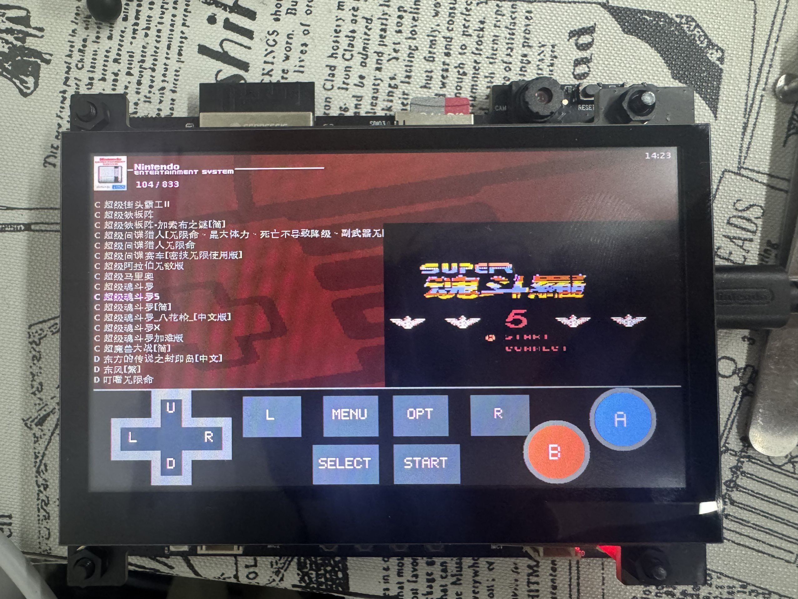
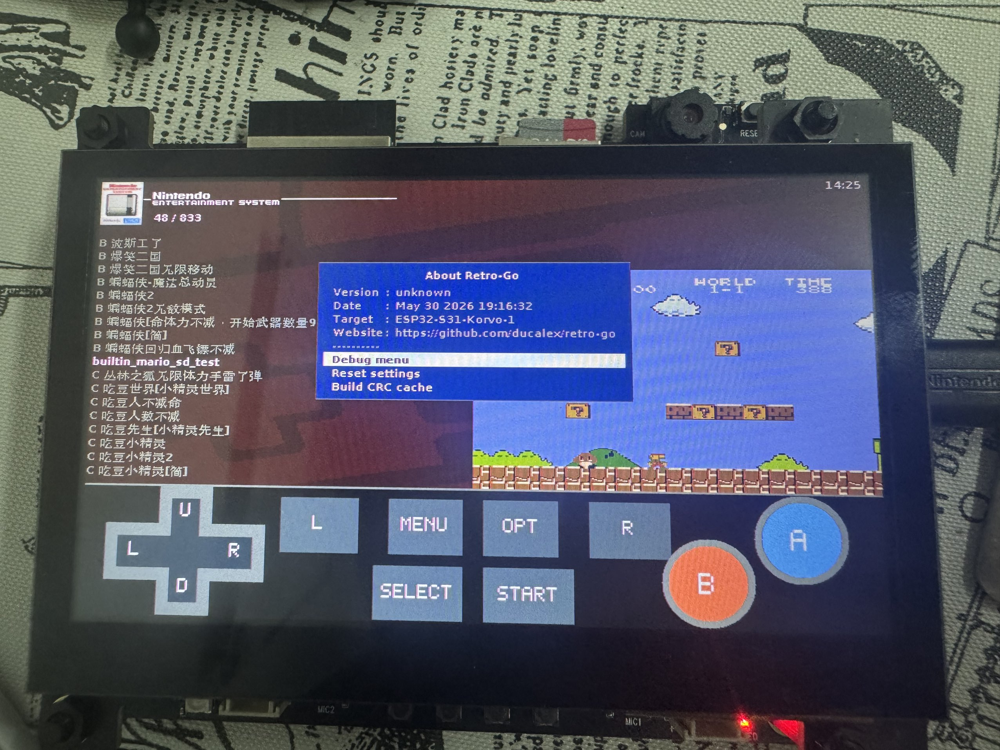

# Retro-Go S31

中文 | [English](#english)

ESP32-S31-Korvo-1 上的 Retro-Go 移植版，整理成了更接近 ESP-IDF 的工程结构。

本工程面向 ESP32-S31-Korvo-1 开发板，使用 ESP32-S3-LCD-EV-Board-SUB3
4.3 寸 800x480 RGB LCD 和触摸屏。固件会打包多个 Retro-Go 应用：

- `launcher`：游戏选择器和系统菜单
- `retro-core`：NES、Game Boy、Game Boy Color、Game & Watch、SNES 等核心
- `gbsp`：Game Boy Advance 核心

## 实机展示

| 中文 ROM 列表和游戏预览 | 虚拟按键和菜单 |
| --- | --- |
|  |  |

[查看演示视频](docs/media/retro-go-s31-demo.mp4)

## 当前状态

这是一个可以分享和继续开发的 S31 移植版本。

最近更新：

- 已合入 [wu0uw/retro-go-s31](https://github.com/wu0uw/retro-go-s31) 的 ES8389
  音频修复和经典蓝牙手柄支持，原始更新由 oowu / wu0uw 完成。

已知问题：

- ES8389 音频路径已经按 wu0uw 的修复调整为 48 kHz、16-bit I2S、无 MCLK 配置。
  如果仍遇到噪声、无声或 BGM 异常，请提交 issue，并尽量附上游戏/核心名称和串口日志。
- 联机功能仍处在实验阶段，不建议把它当作稳定功能使用。

本仓库不包含商业 ROM、BIOS、封面包或 SD 卡游戏内容。

## 硬件

- ESP32-S31-Korvo-1
- ESP32-S3-LCD-EV-Board-SUB3 4.3 寸 800x480 RGB LCD
- 板载触摸控制器
- FAT32 格式 SD 卡
- 可选：接到开发板扬声器接口的喇叭

## 编译

需要使用支持 `esp32s31` 的 ESP-IDF 环境。

```sh
. $IDF_PATH/export.sh
idf.py set-target esp32s31
idf.py build
```

顶层工程是 ESP-IDF 包装工程。普通的 `idf.py build` 会自动构建并打包完整的
Retro-Go 多应用镜像。

常用自定义目标：

```sh
idf.py rg-build-apps   # 只构建 launcher、retro-core 和 gbsp
idf.py rg-image        # 构建并打包完整镜像
idf.py rg-flash        # 构建、打包并烧录
idf.py rg-monitor      # 打开串口监视器
idf.py rg-clean        # 清理子应用构建产物
```

## 镜像文件和烧录

完整全量镜像是：

```text
build/retro-go-s31-full.img
```

它是从地址 `0x0` 开始烧录的整包镜像，适合发布到开发者社区。不要把
`build/retro-go-s31.bin` 当成完整固件，它只是 ESP-IDF 包装工程的小 app bin。

自动烧录：

```sh
idf.py flash
```

指定串口：

```sh
idf.py -p /dev/cu.usbserial-10 flash
```

直接烧录完整镜像：

```sh
esptool.py --chip esp32s31 -p /dev/cu.usbserial-10 -b 1500000 \
  write_flash --flash_size detect 0x0 build/retro-go-s31-full.img
```

如果 1500000 波特率不稳定，可以降低速度：

```sh
ESPBAUD=921600 idf.py flash
```

## 发布包下载

GitHub Release 提供两个常用附件：

- `retro-go-s31_*.bin`：完整全量固件镜像，从地址 `0x0` 烧录。
- `retro-go-s31-sdcard-template.zip`：SD 卡空目录模板，解压到 FAT32 SD 卡根目录。

Release 里的 `.bin` 和本地构建的 `build/retro-go-s31-full.img` 是同类整包镜像，
只是为了兼容部分社区平台要求使用 `.bin` 后缀。

```sh
esptool.py --chip esp32s31 -p /dev/cu.usbserial-10 -b 1500000 \
  write_flash --flash_size detect 0x0 retro-go-s31_*.bin
```

## SD 卡目录

请把 SD 卡格式化为 FAT32。ROM、BIOS 和封面图放在 SD 卡里，不要提交到仓库。

推荐目录结构：

```text
/
├── retro-go/
│   ├── bios/
│   │   ├── gb_bios.bin
│   │   ├── gbc_bios.bin
│   │   ├── fds_bios.bin
│   │   └── msx/
│   ├── config/
│   └── saves/
├── roms/
│   ├── nes/
│   ├── gb/
│   ├── gbc/
│   ├── gba/
│   ├── gw/
│   ├── sms/
│   ├── gg/
│   ├── sg/
│   ├── coleco/
│   ├── pce/
│   ├── lynx/
│   ├── snes/
│   ├── md/
│   └── msx/
└── romart/
    ├── nes/
    ├── gb/
    ├── gbc/
    ├── gba/
    └── ...
```

说明：

- NES 游戏放到 `/roms/nes/`。
- Game Boy 游戏放到 `/roms/gb/`。
- Game Boy Color 游戏放到 `/roms/gbc/`。
- Game Boy Advance 游戏放到 `/roms/gba/`。
- Game & Watch 游戏放到 `/roms/gw/`，需要先用 LCD-Game-Shrinker 打包。
- 封面图放到 `/romart/<system>/`。
- BIOS 不是所有平台都必需，但某些系统或游戏需要 BIOS 才能正常运行。

封面图可以按文件名放置：

```text
/romart/nes/Super Mario Bros.png
```

也可以按 CRC32 放置：

```text
/romart/nes/A/ABCDE123.png
```

在这块板子上，按文件名放封面浏览会更快。

## Wi-Fi

如果构建时启用了网络功能，可以创建：

```text
/retro-go/config/wifi.json
```

示例：

```json
{
  "ssid0": "your-wifi-name",
  "password0": "your-wifi-password"
}
```

为了节省内存，移植调试阶段常用的构建方式会关闭网络：

```sh
python rg_tool.py --target esp32-s31-korvo-1 install --no-networking launcher retro-core gbsp
```

## 作品简介

Retro-Go S31 是一个运行在 ESP32-S31-Korvo-1 开发板上的复古掌机移植项目。
它把 Retro-Go 的多模拟器框架适配到 S31 开发板的 800x480 RGB 屏、触摸输入、
SD 卡存储和 ES8389 音频硬件上，目标是在官方开发板上实现一个可以从 SD 卡选择
NES、GB、GBC、GBA、Game & Watch 等游戏的开源复古游戏机。

当前版本已经可以启动菜单、扫描 SD 卡 ROM、运行多个平台的游戏，并整理成
ESP-IDF 风格的工程方便编译和分享。ES8389 音频修复和经典蓝牙手柄支持来自
oowu / wu0uw 的更新，欢迎社区开发者继续提交 issue、测试日志和改进 PR。

## 开发说明

更多 S31 相关记录在 [README_S31.md](README_S31.md)。

原 Retro-Go 文档仍然适用于模拟器行为、主题和移植：

- [BUILDING.md](BUILDING.md)
- [PORTING.md](PORTING.md)
- [THEMING.md](THEMING.md)
- [LOCALIZATION.md](LOCALIZATION.md)

## 法律说明

本工程基于 Retro-Go 移植，根目录 `LICENSE` / `COPYING` 为 GPL v2 许可证文本。
第三方模拟器核心和库保留各自的许可证与版权声明，详见对应目录。

本仓库不包含商业 ROM 或受版权保护的游戏 dump。请只使用你有权使用和分发的文件。
发布固件镜像时，请同时提供源码仓库链接和许可证说明。

更多声明见 [NOTICE.md](NOTICE.md)。

## Issue

欢迎 issue 和 pull request，尤其是：

- ES8389 音频兼容性反馈
- 经典蓝牙手柄兼容性反馈
- ESP32-S31-Korvo-1 板级支持改进
- SD 卡兼容性反馈
- 模拟器兼容性记录

---

## English

Retro-Go port for the ESP32-S31-Korvo-1 board, packaged as an ESP-IDF-friendly
project.

This tree targets the ESP32-S31-Korvo-1 board with the ESP32-S3-LCD-EV-Board-SUB3
4.3-inch 800x480 RGB LCD and touch panel. It builds a multi-app Retro-Go image
containing:

- `launcher`
- `retro-core` for NES, Game Boy, Game Boy Color, Game & Watch, SNES and other
  Retro-Go cores
- `gbsp` for Game Boy Advance

## Gallery

| Chinese ROM list and game preview | Virtual controls and menu |
| --- | --- |
|  |  |

[Watch the demo video](docs/media/retro-go-s31-demo.mp4)

## Status

This is a work-in-progress shareable S31 port.

Recent update:

- The ES8389 audio fix and Classic Bluetooth gamepad support from
  [wu0uw/retro-go-s31](https://github.com/wu0uw/retro-go-s31) have been merged.
  The original update was made by oowu / wu0uw.

Known issues:

- The ES8389 audio path now follows wu0uw's 48 kHz, 16-bit I2S, no-MCLK fix.
  If you still hit noise, silence or BGM problems, please open an issue with
  the game/core name and a serial log if possible.
- Netplay is still experimental and should not be treated as stable.

ROMs, BIOS files, cover packs and SD card contents are not included.

## Hardware

- ESP32-S31-Korvo-1
- ESP32-S3-LCD-EV-Board-SUB3 4.3-inch 800x480 RGB LCD
- Touch controller compatible with the board resource package
- FAT32 SD card
- Optional speaker connected to one of the board speaker outputs

## Build

Use an ESP-IDF environment that supports `esp32s31`.

```sh
. $IDF_PATH/export.sh
idf.py set-target esp32s31
idf.py build
```

The root project is an ESP-IDF wrapper. A normal `idf.py build` builds and packs
the full Retro-Go multi-app image.

Useful custom targets:

```sh
idf.py rg-build-apps   # build launcher, retro-core and gbsp
idf.py rg-image        # build and pack the full image
idf.py rg-flash        # build, pack and flash
idf.py rg-monitor      # open serial monitor
idf.py rg-clean        # remove app build outputs
```

## Firmware Image And Flashing

The full flash image is:

```text
build/retro-go-s31-full.img
```

It is a complete image flashed at offset `0x0`, suitable for community releases.
Do not use `build/retro-go-s31.bin` as a full firmware image; that file is only
the small ESP-IDF wrapper app bin.

Auto-detect port:

```sh
idf.py flash
```

Explicit port example:

```sh
idf.py -p /dev/cu.usbserial-10 flash
```

Direct full-image flashing example:

```sh
esptool.py --chip esp32s31 -p /dev/cu.usbserial-10 -b 1500000 \
  write_flash --flash_size detect 0x0 build/retro-go-s31-full.img
```

If 1500000 baud is unstable on your cable, try:

```sh
ESPBAUD=921600 idf.py flash
```

## Release Downloads

GitHub Releases provide two common assets:

- `retro-go-s31_*.bin`: complete full firmware image, flashed at offset `0x0`.
- `retro-go-s31-sdcard-template.zip`: empty SD card directory template, extracted
  to the root of a FAT32 SD card.

The Release `.bin` file is the same kind of full image as the locally built
`build/retro-go-s31-full.img`; the `.bin` suffix is provided for community
platforms that require it.

```sh
esptool.py --chip esp32s31 -p /dev/cu.usbserial-10 -b 1500000 \
  write_flash --flash_size detect 0x0 retro-go-s31_*.bin
```

## SD Card Layout

Format the SD card as FAT32. Put ROMs, BIOS files and covers on the card; do not
commit them to this repository.

Recommended layout:

```text
/
├── retro-go/
│   ├── bios/
│   │   ├── gb_bios.bin
│   │   ├── gbc_bios.bin
│   │   ├── fds_bios.bin
│   │   └── msx/
│   ├── config/
│   └── saves/
├── roms/
│   ├── nes/
│   ├── gb/
│   ├── gbc/
│   ├── gba/
│   ├── gw/
│   ├── sms/
│   ├── gg/
│   ├── sg/
│   ├── coleco/
│   ├── pce/
│   ├── lynx/
│   ├── snes/
│   ├── md/
│   └── msx/
└── romart/
    ├── nes/
    ├── gb/
    ├── gbc/
    ├── gba/
    └── ...
```

Notes:

- NES games go in `/roms/nes/`.
- Game Boy games go in `/roms/gb/`.
- Game Boy Color games go in `/roms/gbc/`.
- Game Boy Advance games go in `/roms/gba/`.
- Game & Watch games go in `/roms/gw/`; they must be packed with
  LCD-Game-Shrinker before use.
- Cover images go under `/romart/<system>/`.
- BIOS files are optional except for systems or games that require them.

Cover art may be filename-based:

```text
/romart/nes/Super Mario Bros.png
```

or CRC32-based:

```text
/romart/nes/A/ABCDE123.png
```

Filename-based covers are faster to browse on this board.

## Wi-Fi

For builds with networking enabled, create:

```text
/retro-go/config/wifi.json
```

Example:

```json
{
  "ssid0": "your-wifi-name",
  "password0": "your-wifi-password"
}
```

The default shared build command used during bring-up disables networking to
save memory:

```sh
python rg_tool.py --target esp32-s31-korvo-1 install --no-networking launcher retro-core gbsp
```

## Project Description

Retro-Go S31 is a retro handheld console port for the ESP32-S31-Korvo-1
development board. It adapts Retro-Go's multi-emulator framework to the S31
board's 800x480 RGB display, touch input, SD card storage and ES8389 audio
hardware, with the goal of turning the official board into an open-source retro
game console that can launch NES, GB, GBC, GBA, Game & Watch and other games
from an SD card.

The current version can boot the launcher, scan ROMs from the SD card and run
games on several cores. The project has also been reorganized as an ESP-IDF-style
tree for easier building and sharing. The ES8389 audio fix and Classic Bluetooth
gamepad support come from oowu / wu0uw's update. Issues, test logs and pull
requests are welcome.

## Development Notes

More S31-specific details are in [README_S31.md](README_S31.md).

Original Retro-Go documentation is still useful for emulator behavior, theming
and porting:

- [BUILDING.md](BUILDING.md)
- [PORTING.md](PORTING.md)
- [THEMING.md](THEMING.md)
- [LOCALIZATION.md](LOCALIZATION.md)

## Legal

This project is a port based on Retro-Go. The root `LICENSE` / `COPYING` files
contain the GPL v2 license text. Third-party emulator cores and libraries keep
their own license and copyright notices in their respective directories.

This repository does not include commercial ROMs or copyrighted game dumps.
Only add files you have the right to redistribute. When distributing firmware
images, provide the source repository link and license notices together with the
binary.

See [NOTICE.md](NOTICE.md) for more details.

## Issues

Issues and pull requests are welcome, especially for:

- ES8389 audio compatibility feedback
- Classic Bluetooth gamepad compatibility feedback
- ESP32-S31-Korvo-1 board support improvements
- SD card compatibility
- emulator compatibility notes
